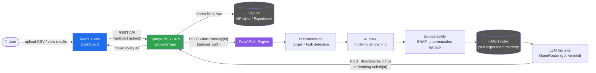
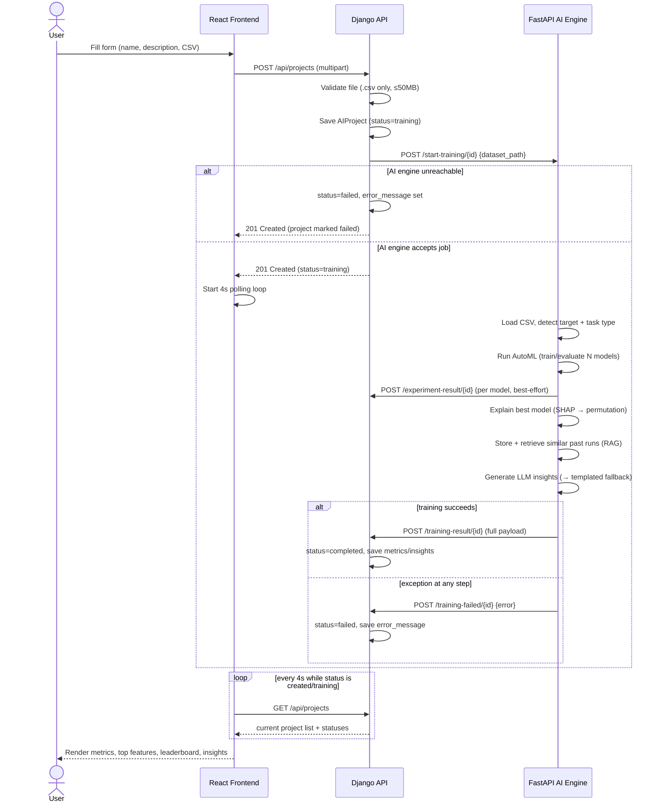
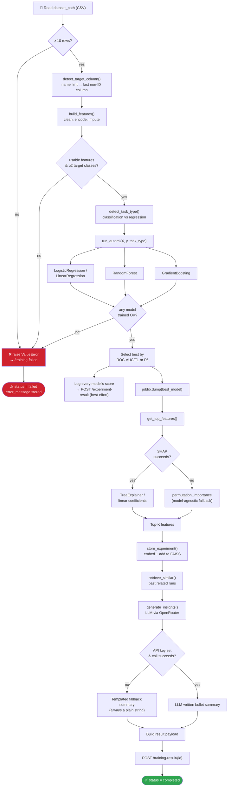
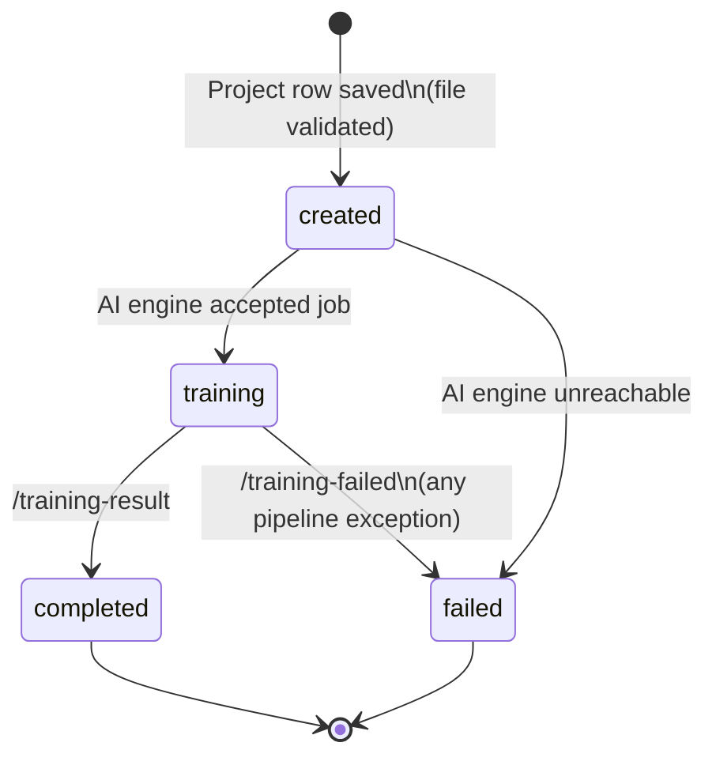

# InsightForge AI

InsightForge AI is an agentic AutoML platform. Upload any tabular CSV and the system automatically detects the target column and task type (classification or regression), trains and benchmarks several candidate models, picks the best one, explains why it made its predictions with SHAP, and writes a plain-English summary using an LLM that also remembers insights from past runs (RAG).

There is no dataset-specific configuration required — point it at a churn file, a housing-price file, or anything else with a target column, and it adapts.

## Table of Contents

- [Key Features](#key-features)
- [Tech Stack](#tech-stack)
- [System Architecture](#system-architecture)
- [End-to-End Workflow](#end-to-end-workflow)
- [AI Engine — Project / Training Flow](#ai-engine--project--training-flow)
- [Project Status Lifecycle](#project-status-lifecycle)
- [Repository Structure](#repository-structure)
- [API Reference](#api-reference)
- [Getting Started](#getting-started)
- [Environment Variables](#environment-variables)
- [Design Notes & Failure Handling](#design-notes--failure-handling)

## Key Features

| Capability | Description |
| :--- | :--- |
| 🎯 **Auto target/task detection** | Detects the target column from name hints (e.g. churn, label, target) or falls back to the last non-ID-like column; infers classification vs. regression from the target's value distribution. |
| 🤖 **Task-aware AutoML** | Trains multiple candidate models per task (Logistic/Linear Regression, Random Forest, Gradient Boosting) and automatically selects the best by the appropriate metric (ROC-AUC/F1 for classification, R²/RMSE for regression). |
| 🔍 **Explainability with fallback** | Uses SHAP to explain the winning model's top features; if SHAP fails for any reason, falls back to permutation importance so a result is always produced. |
| 🧠 **RAG memory across runs** | Every completed run is embedded and stored in a FAISS index; new runs retrieve similar past experiments to give the LLM context — and degrade gracefully to "no memory" if the embedding model/network is unavailable. |
| 📝 **LLM-written insights** | An LLM (via OpenRouter) turns the model's top features into a short, plain-English explanation. Falls back to a templated, feature-based summary if no API key is set or the call fails. |
| 📡 **Resilient orchestration** | Django and the FastAPI engine talk over HTTP callbacks with retries; any failure mid-pipeline is captured and reported back with the real error, instead of leaving a project stuck at training forever. |
| 🖥️ **Live dashboard** | React frontend shows every project in every status, auto-polls while anything is training/created, and lets users create a new project directly from the UI. |

## Tech Stack

- **Frontend:** React 19 + Vite, Axios
- **Core Backend:** Django + Django REST Framework, SQLite, `django-cors-headers`
- **AI Engine:** FastAPI, pandas, scikit-learn, SHAP, joblib
- **LLM / RAG:** LangChain + OpenRouter (`openai/gpt-4o-mini` by default), FAISS, sentence-transformers (`all-MiniLM-L6-v2`)

## System Architecture

Three independent services, each with a single responsibility: the frontend is a thin client, Django owns project state and file storage, and the FastAPI AI engine does all the machine-learning work and reports back over HTTP.



## End-to-End Workflow

This sequence covers a full request: creating a project, kicking off training, and the two possible outcomes (success or failure).



## AI Engine — Project / Training Flow

What actually happens inside `/start-training/{project_id}`, from raw CSV to stored result. Every stage that can fail either has a fallback or surfaces a real error — nothing dies silently.



## Project Status Lifecycle



## Repository Structure

```
InsightForge-AI/
├── frontend/                     # React + Vite dashboard
│   └── src/
│       ├── pages/
│       │   └── Dashboard.jsx     # Polls Django, lists all projects
│       ├── components/
│       │   ├── ProjectCreateForm.jsx  # Upload CSV → POST /api/projects
│       │   ├── ProjectCard.jsx        # Status-aware project display
│       │   ├── StatusBadge.jsx
│       │   ├── FeatureList.jsx        # Top-feature importances
│       │   ├── ExperimentalTable.jsx  # Model leaderboard
│       │   └── InsightBox.jsx         # LLM / fallback insights
│       └── services/
│           └── api.js            # Axios client (VITE_API_BASE_URL)
├── core-backend/
│   └── platform_core/
│       ├── platform_core/
│       │   └── settings.py       # AI_ENGINE_URL, CORS, env-based config
│       └── projects/
│           ├── models.py         # AIProject, Experiment
│           ├── serializers.py    # Upload validation (.csv, 50MB max)
│           ├── views.py          # Create/list/detail + training callbacks
│           └── urls.py
└── ai-engine/
    └── app/
        ├── main.py               # /start-training orchestrator
        ├── preprocessing.py      # Target/task detection, cleaning
        ├── automl.py             # Multi-model train + evaluate
        ├── explainability.py     # SHAP + permutation fallback
        ├── insights.py           # LLM summary + templated fallback
        └── rag/
            └── vector_store.py   # FAISS memory of past runs
```

## API Reference

All endpoints are served by Django at `/api/projects/`.

| Method | Endpoint | Called by | Purpose |
| :--- | :--- | :--- | :--- |
| `GET` | `/` | Frontend | List all projects (with nested experiments) |
| `POST` | `/` | Frontend | Create a project (multipart: `name`, `problem_description`, `dataset_file`) — kicks off training |
| `GET` | `/{project_id}/` | Frontend | Fetch a single project's detail |
| `POST` | `/training-result/{project_id}/` | AI Engine | Report a completed run (metrics, top features, insights) |
| `POST` | `/training-failed/{project_id}/` | AI Engine | Report a failed run with an error message |
| `POST` | `/experiment-result/{project_id}/` | AI Engine | Log one candidate model's score (leaderboard row) |

The AI Engine itself exposes:

| Method | Endpoint | Purpose |
| :--- | :--- | :--- |
| `GET` | `/health` | Liveness check |
| `POST` | `/start-training/{project_id}` | Trigger the full pipeline for a given dataset path |

## Getting Started

### 1. Core Backend (Django)

```bash
cd core-backend/platform_core
python -m venv venv
source venv/bin/activate # venv\Scripts\activate on Windows
pip install -r ../requirements.txt
python manage.py migrate
python manage.py runserver 8000
```

### 2. AI Engine (FastAPI)

```bash
cd ai-engine
python -m venv venv
source venv/bin/activate # venv\Scripts\activate on Windows
pip install -r requirements.txt
cp .env.example .env # fill in OPENROUTER_API_KEY for real LLM insights
uvicorn app.main:app --reload --port 8001
```

> [!NOTE]
> Without `OPENROUTER_API_KEY`, the engine still completes the full pipeline end-to-end — it just returns a templated, feature-based summary instead of an LLM-written one. RAG memory degrades the same way if it cannot reach HuggingFace to fetch the embedding model.

### 3. Frontend (React)

```bash
cd frontend
npm install
npm run dev
```

By default the frontend talks to `http://127.0.0.1:8000/api/projects`. Override with a `.env` containing `VITE_API_BASE_URL=...` if needed.

## Environment Variables

### Core Backend (`core-backend/platform_core`)

| Variable | Default | Purpose |
| :--- | :--- | :--- |
| `DJANGO_SECRET_KEY` | `dev placeholder` | Django secret key |
| `DJANGO_DEBUG` | `True` | Debug mode |
| `DJANGO_ALLOWED_HOSTS` | `127.0.0.1,localhost` | Comma-separated allowed hosts |
| `AI_ENGINE_URL` | `http://127.0.0.1:8001` | Base URL the backend calls to trigger training |

### AI Engine (`ai-engine`)

| Variable | Default | Purpose |
| :--- | :--- | :--- |
| `DJANGO_BASE_URL` | `http://127.0.0.1:8000/api/projects` | Where callbacks are POSTed |
| `MODELS_DIR` | `models` | Where trained model `.pkl` files are saved |
| `OPENROUTER_API_KEY` | — | Enables real LLM-written insights (optional) |
| `LLM_MODEL` | `openai/gpt-4o-mini` | Model used via OpenRouter |
| `RAG_INDEX_FILE` | `rag_index.faiss` | FAISS index path |
| `RAG_DATA_FILE` | `rag_data.pkl` | Stored experiment text path |

### Frontend (`frontend`)

| Variable | Default | Purpose |
| :--- | :--- | :--- |
| `VITE_API_BASE_URL` | `http://127.0.0.1:8000/api/projects` | Django API base URL |

## Design Notes & Failure Handling

- **Dataset Validation:** Only `.csv` datasets are accepted, validated server-side with a 50MB size limit.
- **Graceful Fallbacks:** Every ML stage has a fallback, so a single dependency or data quirk never crashes the whole pipeline: SHAP → permutation importance, LLM insights → templated summary, RAG memory → silently skipped if unavailable.
- **No Silent Failures:** Any exception during training is caught, logged with a full traceback, and reported to Django via `/training-failed`, so a project can never get stuck at training with no explanation.
- **Plain-String Insights:** Insights are always a plain string, never a list — this is enforced both at the source (`insights.py`) and defensively in the Django view, and the model field is a `TextField` rather than a `JSONField`.
- **Resilient Callbacks:** Synchronous HTTP-callback architecture (Django → FastAPI → Django) by design, hardened with retries on outbound calls — no task queue (e.g. Celery) is introduced.
- **Security:** If the `OPENROUTER_API_KEY` was ever hardcoded in source and pushed to a public repo, treat it as compromised and rotate it; this project loads it from an environment variable only.
